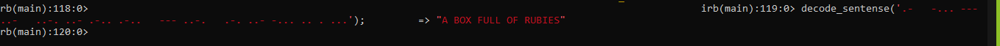

# morse decoder

## Getting Started

**Important note: this file might include queries that make changes in the database (e.g., remove records). Use them responsibly!**

## Author 1

👤 **Okoroji Victor aka Vickymarz**

- GitHub: [@githubhandle](https://github.com/vickymarz)

- LinkedIn: [LinkedIn](https://www.linkedin.com/in/okoroji-victor-ebube-8791741a0)

## Author 2

👤 **Zahra Arshia**

- GitHub: [@githubhandle](https://github.com/ZahraArshia)

- LinkedIn: [LinkedIn](https://www.linkedin.com/in/zahra-arshia/)

## 🤝 Contributing

Contributions, issues, and feature requests are welcome!

Feel free to check the [issues page](../../issues/).

## Show your support

Give a ⭐️ if you like this project!

## Acknowledgments

- Microverse 
- Coding partner

## 📝 License

This project is [MIT](./MIT.md) licensed.
